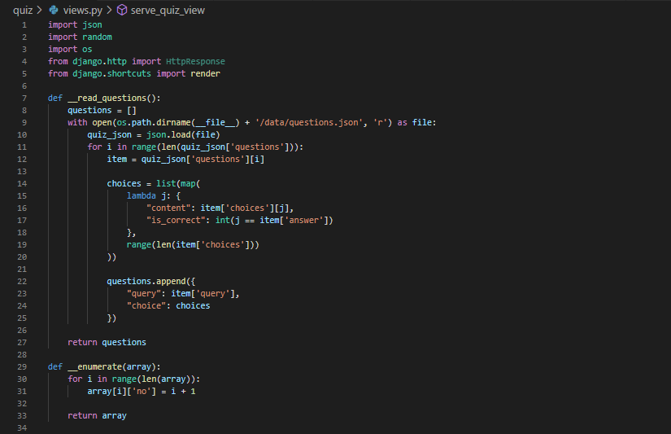
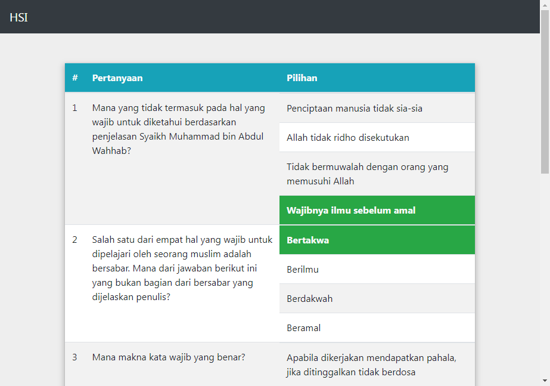
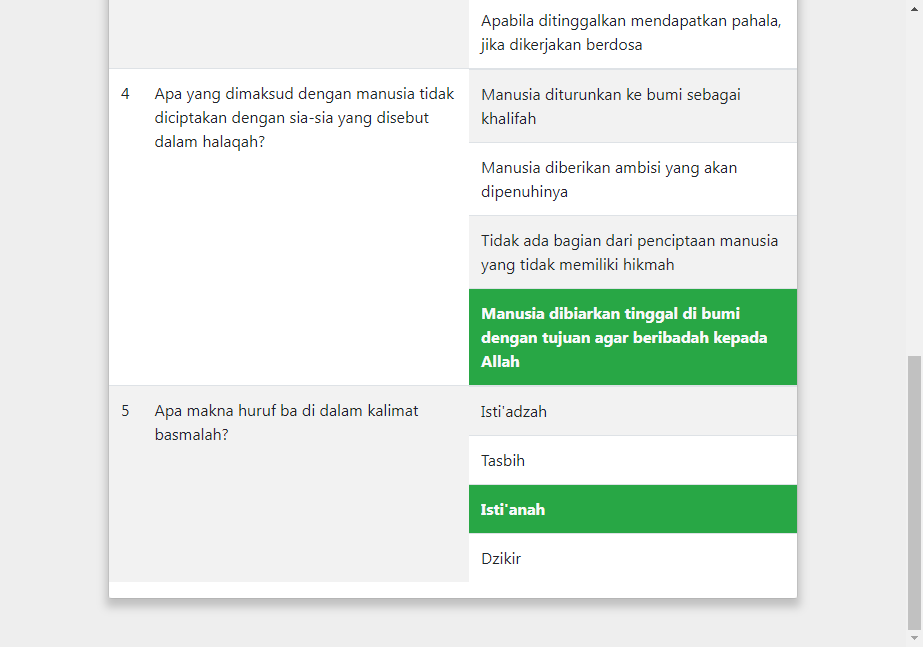
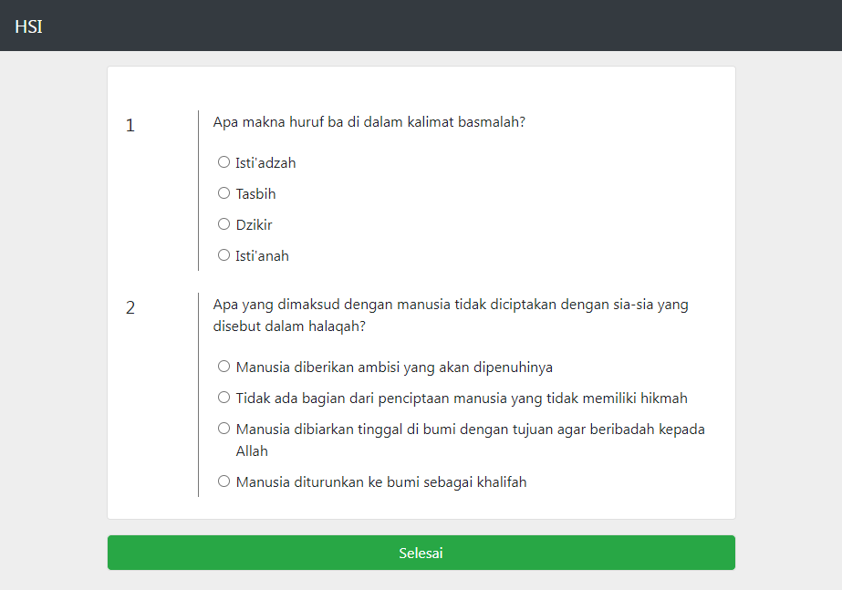
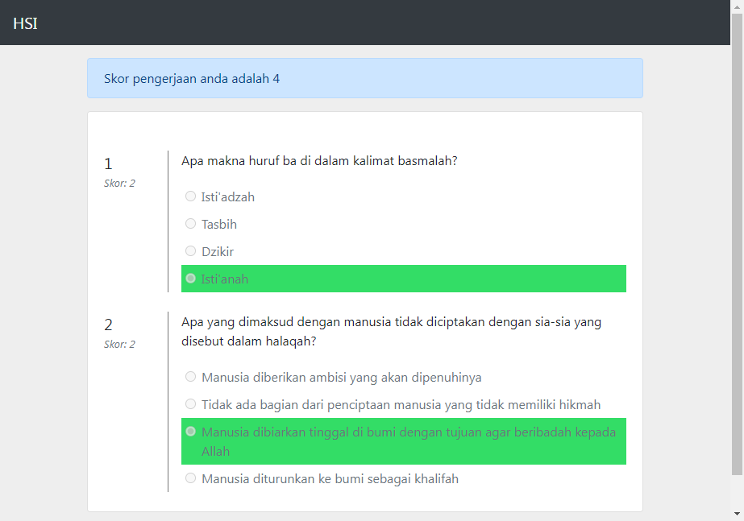
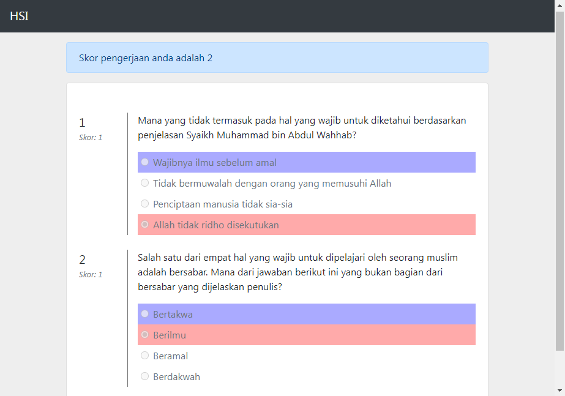
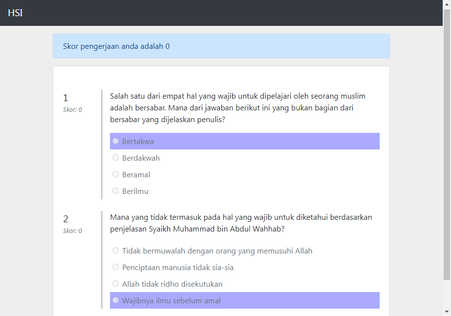
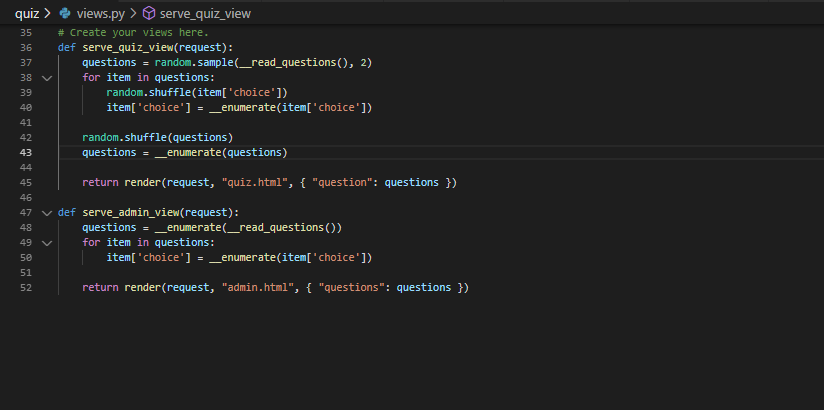
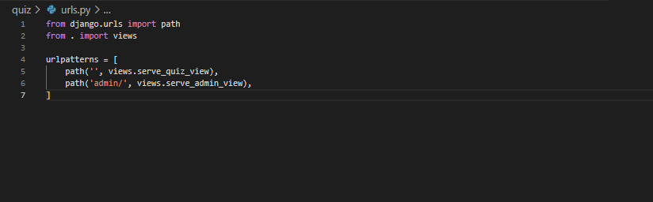
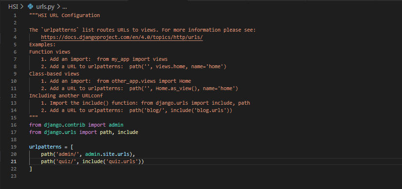

# Playground Quiz HSI With Django

Repositori ini merupakan _writeup_ project untuk mengimplementasi quiz HSI menggunakan Django. Spesifikasi yang diberikan adalah sebagai berikut:

1. Membuat bank soal kurang lebih 5 soal.
2. Membuat halaman HTML untuk admin yang menampilkan seluruh butir soal yang tersedia. 
3. Membuat tampilan HTML untuk peserta mengerjakan soal. Munculkan 2 soal saja secara acak.
4. Pengerjaan evaluasi dan cek jawaban menggunakan javascript bisa menunjukkan benar salah pengerjaaan

Pengerjaan project menggunakan _stack_ berikut:
- Django v4.0.3, 
- Python v3.8.2,
- Bootstrap 4 (lengkap dengan _third party library_ yang dibutuhkan seperti JQuery)

## Implementasi pembuatan bank soal

Bank soal yang diimplementasi menggunakan _resource_ yang telah dibuat pada level kelas sebelumnya. Bank soal dibuat dalam format file _json_. Konten bank soal dapat dilihat pada `quiz/data/questions.json`

## _Preprocessing_ soal

Bank soal yang disimpan dalam bentuk file _json_ diproses terlebih dahulu menjadi bentuk yang mudah untuk digunakan. Struktur soal yang selanjutnya akan digunakan adalah sebagai berikut.

### Object model _Question_
```json
{
    "no": <int>,
    "query": <string>,
    "choice": [<Choice>]
}
```

### Object model _Choice_
```json
{
    "no": <int>,
    "content": <string>,
    "is_correct": <int:0|1>
}
```

Untuk mempermudah _preprocessing_, dibuat dua fungsi. Fungsi pertama bertugas untuk membaca file _json_, dan fungsi kedua bertugas untuk memberikan penomoran pada setiap object model.



## Halaman admin

Halaman admin dibuat dengan memanfaatkan template syntax `for` untuk mengiterasi object model _Question_ dan _Choice_. Untuk tata letak, digunakan `<table>`. Tata letak daftar pilihan jawaban juga menggunakan `<table>`, sehingga ada sebuah `<table>` di dalam `<table>`. Lalu untuk memberi _highlight_ jawaban mana yang merupakan jawaban yang benar, `<td>` sel jawaban yang benar diberi warna hijau dan teksnya dicetak tebal.




## Halaman quiz

Halaman quiz dibuat dengan memanfaatkan css class `.form-check` dari Bootstrap. Class `.form-check` akan digunakan untuk mengelompokkan `<input type="radio">` dengan teks pilihan jawaban. Sehingga template markup yang digunakan adalah sebagai berikut.

```html
<div class="form-check">
  <input type="radio" class="form-check-input" name="q$" id="q$-a&" value="{{ option.is_correct }}">
  <label for="q$-a&" class="form-check-label">(teks jawaban)</label>
</div>
```
dimana:
- nilai `$` akan diganti dengan nomor urutan soal,
- nilai `&` akan diganti dengan nomor urutan pilihan,
- nilai `@` akan diganti dengan nilai apakah jawaban yang bersangkutan merupakan jawaban yang benar (berupa nilai string `1` atau `0`)

Template ini akan digunakan untuk memberikan _feedback_ penilaian setelah pengerjaan quiz selesai.

Ketika pengguna menyelesaikan pengerjaan, client akan memeriksa jawaban yang dipilih (jika ada) dan memeriksa apakah jawaban tersebut benar atau salah. Secara garis besar, alur pemeriksaan yang dilakukan adalah sebagai berikut:

1. _Highlight_ semua jawaban yang seharusnya dipilih oleh pengguna dengan warna biru
2. Untuk setiap pertanyaan,
    1. Periksa apakah ada jawaban yang terpilih
        1. Jika ada jawaban yang terpilih, periksa apakah `value` jawaban terpilih bernilai `1` atau bukan.
            1. Jika ya, skor untuk pertanyaan yang bersangkutan adalah `2`. _Highlight_ jawaban tersebut dengan warna hijau. Ini akan menimpa warna _highlight_ pada langkah 1
            2. Jika tidak, skor untuk pertanyaan yang bersangkutan adalah `1`. _Highlight_ jawaban tersebut dengan warna merah
        2. Jika tidak ada jawaban yang terpilih, skor untuk pertanyaan yang bersangkutan adalah `0`.
    2. Tampilkan skor pertanyaan di bawah nomor pertanyaan
    3. Tambahkan skor pertanyaan ke skor keseluruhan

Alur ini akan memberikan skor total. Skor total akan dimunculkan di bagian atas halaman quiz setelah pengerjaan selesai. Pada saat itu, halaman quiz akan membekukan jawaban sehingga pengguna tidak bisa mengubah jawaban.






## Penentuan route

Route web untuk quiz menggunakan segment `quiz/` sebagai base segmentnya. Halaman pengerjaan quiz bisa diakses pada url `quiz/` (yaitu menggunakan base segment), dan halaman admin quiz bisa diakses pada url `quiz/admin/`.



